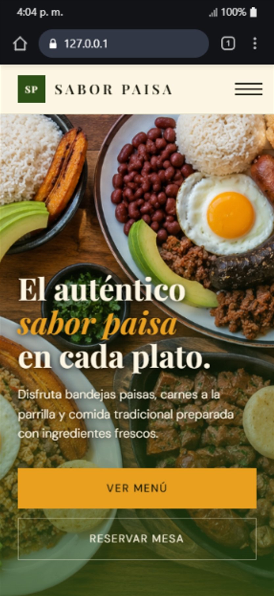

# 🍽️ Sabor Paisa


Landing Page responsive desarrollada para **Sabor Paisa**, un restaurante (_ficticio_) de comida típica colombiana que busca ofrecer a sus clientes una forma rápida y sencilla de consultar el menú, conocer los horarios de atención, ubicar el restaurante y realizar reservas desde cualquier dispositivo.

Este proyecto fue desarrollado como parte de mi portafolio profesional con el objetivo de poner en práctica habilidades en desarrollo web utilizando HTML, CSS y JavaScript Vanilla.

---

## 📸 Vista previa


---

## 📖 Descripción

Actualmente el restaurante utiliza únicamente Instagram como medio de información. Sin embargo, muchos clientes preguntan frecuentemente por:

- El menú disponible.
- Los horarios de atención.
- La ubicación.
- Cómo realizar una reserva.

Este proyecto busca solucionar ese problema mediante un sitio web moderno, ligero y completamente responsive.

---

## ✨ Características

- Diseño Mobile First.
- Navegación responsive.
- Header fijo.
- Menú hamburguesa para móviles.
- Hero con llamada a la acción.
- Tarjetas de platos.
- Horarios y ubicación.
- Google Maps embebido.
- Formulario de reservas.
- Código semántico y accesible.
---

## 🛠️ Tecnologías utilizadas

- HTML5
- CSS3
- JavaScript (Vanilla JS)
- Google Maps (Embed API)
- Google Fonts
- Font Awesome
- Git
- GitHub
- GitHub Pages

---

## 📂 Estructura del proyecto

```text
sabor-paisa/
│
├── LICENSE
├── README.md
├── index.html
│
├── assets/
│   ├── images/
│   │   ├── hero-image.png
│   │   └── menu/
│   │       └── plato-bandeja-paisa.jpg
│   │
│   ├── screenshots/
│   │   ├── desktop/
│   │   │   ├── demo-desktop-v1.gif
│   │   │   └── home-desktop.png
│   │   └── mobile/
│   │       ├── demo-mobile-v1.gif
│   │       └── home-mobile.png
│
├── css/
│   ├── base.css
│   ├── styles.css
│   └── variables.css
│
└── js/
    └── script.js
```

---

## 🏗️ Arquitectura

El proyecto sigue una estructura modular para facilitar el mantenimiento.

### CSS

- **variables.css**
  - Variables CSS globales.
  - Paleta de colores.
  - Tipografías.
  - Espaciados.

- **base.css**
  - Reset.
  - Estilos globales.
  - Tipografía.
  - Elementos HTML comunes.

- **styles.css**
  - Estilos específicos de cada sección del sitio.

---

## 🗂️ Estructura del sitio

La página estará compuesta por las siguientes secciones:

1. Header
2. Hero
3. Menú
4. Horarios y ubicación
5. Reservas
6. Footer

---

## 📱 Diseño Responsive

El sitio está pensado bajo una estrategia **Mobile First**, garantizando una correcta visualización en:

- Celulares
- Tablets
- Computadores

---

## 🚧 Estado del proyecto

Actualmente el proyecto se encuentra en **fase de desarrollo del frontend**.

Se ha completado la estructura HTML, la organización del proyecto y la base de estilos junto con el diseño responsive. En las siguientes etapas se implementarán las interacciones con JavaScript, el funcionamiento del menú hamburguesa y la integración del formulario de reservas.

---

## 🛣️ Roadmap

- [x] Planificación.
- [x] Wireframe.
- [x] Organización del proyecto.
- [x] Maquetación HTML.
- [x] Definición de variables CSS.
- [x] Estilos base.
- [x] Completar estilos del Hero.
- [x] Diseñar el menú de platos.
- [x] Adaptar a tablet.
- [x] Adaptar a escritorio.

### Próximas tareas

- [ ] Optimizar rendimiento (Lighthouse).
- [ ] SEO básico.
- [ ] Implementar el menú hamburguesa.
- [ ] Validar accesibilidad.
- [ ] Optimizar imágenes.
- [ ] Publicar en GitHub Pages.

---

## 📐 Buenas prácticas implementadas

- HTML5 semántico.
- Diseño Mobile First.
- CSS modular.
- Variables CSS.
- Accesibilidad mediante atributos ARIA.
- Uso de etiquetas semánticas (`header`, `main`, `section`, `article`, `footer`, `nav`, `figure`, `address`, `time`).

---

## 🚀 Instalación

Clona este repositorio:

```bash
git clone https://github.com/ZulangySatizabal/sabor-paisa.git
```

Ingresa al proyecto:

```bash
cd sabor-paisa
```

Abre el archivo:

```text
index.html
```

Puedes utilizar la extensión **Live Server** de Visual Studio Code para visualizar el proyecto durante el desarrollo.

---

## 🌐 Despliegue

El proyecto será publicado mediante **GitHub Pages**.

> Enlace disponible cuando el proyecto esté finalizado.

---

## 📷 Capturas

### Escritorio

#### 📷 Vista previa


#### 🎬 Demostración


### Móvil

#### 📷 Vista previa



#### 🎬 Demostración


---

## 👩‍💻 Autora

**Zulangy Satizabal**

- [GitHub](https://github.com/ZulangySatizabal)
- [LinkedIn](https://www.linkedin.com/in/zulangy-satizabal/)

---

## 📄 Licencia

Este proyecto se distribuye bajo la **Licencia MIT**. Consulta el archivo `LICENSE` para obtener más información.